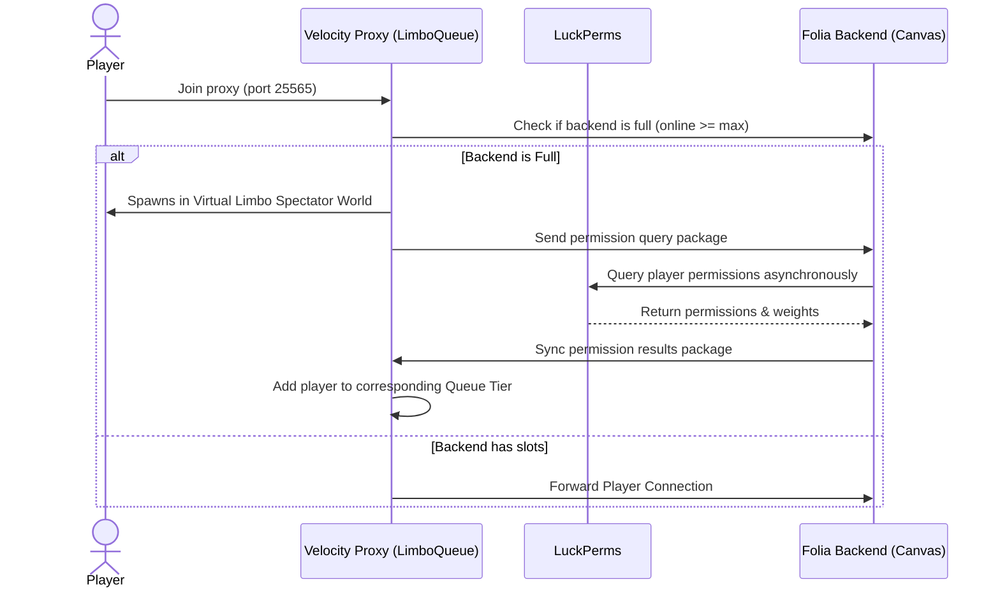

# LimboQueue

A modern, high-performance Minecraft proxy queue system built for **Velocity** and **Folia/Canvas** backend servers. It leverages the **LimboAPI** to transition queuing players into a lightweight spectator world, minimizing resource utilization on the proxy while enforcing a highly configurable, multi-tiered queue.

## Features

- **Limbo Integration**: Queuing players reside inside a virtual spectacle world (End-theme void by default) rather than a physical server.
- **Three-Tier Queue Priority**:
  - **Bypass (Tier 1)**: Skips the queue entirely or jumps straight to the front of the line (configurable permission-based priority).
  - **Ranks (Tier 2)**: Sorted dynamically by LuckPerms group weights. Higher-tier ranks jump ahead of lower-tier ranks.
  - **Regular (Tier 3)**: Standard First-In, First-Out (FIFO) queue for normal players.
- **Dynamic Stats Actionbar & Title**: Real-time position tracking, total queue size, and ETA statistics displayed on-screen.
- **Cross-Server Syncing**: Syncs permissions asynchronously between the Folia backend and Velocity proxy using server plugin messaging, without requiring a shared MySQL database.

## Architecture



## Compilation

Build the shadow jars for deployment:
```bash
./gradlew build
```

The compiled jars will be generated in:
* Velocity Plugin: `limboqueue-velocity/build/libs/limboqueue-velocity-1.0.0.jar`
* Folia/Canvas Plugin: `limboqueue-folia/build/libs/limboqueue-folia-1.0.0.jar`
